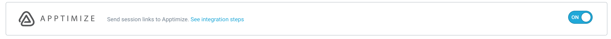

# 3rd Party Integrations
UserExperior’s 3rd party integration enables you to integrate UserExperior with industry-leading quantitative analytics tools. This integration enables you to look at both quantitative and qualitative data inside your analytics tool.


## Amplitude
### Integration
#### 1. Switch On the Amplitude in UserExperior Settings

  Go to UserExperior Dashboard > Go to your app folder > Go to Settings > Select Integrations > Switch On **Amplitude**
  
  
  
  **Note:** Make sure to switch on the integration for respective platform i.e. for the Androind and the iOS. 

#### 2. Add UserExperior Listener/ Delegate immediately after startRecording:

  **Note:** In case of more than one 3rd party integrations, reuse the Listener/ Delegate mentioned below.

##### Android

Add following code in onCreate method of every launcher activity.

```
UserExperior.startRecording(getApplicationContext(), "your-version-key-here");

// UserExperior Listener: Third Party Integration
UserExperior.setUserExperiorListener(new UserExperiorListener() {
  @Override
  public void onUserExperiorStarted() {
      // Sending UserExperior Session URL to Amplitude
      String ueSessionUrl = UserExperior.getSessionUrl("Amplitude");
      
      JSONObject eventProperties = new JSONObject();
      try{
        eventProperties.put("UE_Session_URL", ueSessionUrl);
      } catch (JSONException exception) {
      }
      Amplitude.getInstance().logEvent("UE_Session_URL", eventProperties);
  }
});
```

##### iOS
  
###### Swift
   ```
       // Step 1: Add the UserExperiorDelegate protocol in your `AppDelegate.swift`
        class AppDelegate: UIResponder, UIApplicationDelegate, UserExperiorDelegate {
        }
        
        func application(_ application: UIApplication, didFinishLaunchingWithOptions launchOptions: [UIApplication.LaunchOptionsKey: Any]?) -> Bool {
            UserExperior.initialize("USER_KEY")
            
        // Step 2: Setting delegate after UserExperior initialize
            UserExperior.setDelegate(self)
            return true
        }

      // Step 3: Implement UserExperiorDelegate protocol
        func userExperiorSessionStarted() {
            let sessionURL = UserExperior.getSessionUrl("AMPLITUDE") // "AMPLITUDE" is the key used to identify Amplitude
            Amplitude.instance()?.logEvent("UE_Session_URL", withEventProperties: ["UE_Session_URL": sessionURL])
        }
  ```

######  Objective-C
   ```
       // Step 1: Add the UserExperiorDelegate protocol in your `AppDelegate.m`
        @interface AppDelegate () <UserExperiorDelegate>
        @end

        - (BOOL)application:(UIApplication *)application didFinishLaunchingWithOptions:(NSDictionary *)launchOptions {
            // Override point for customization after application launch.
            [UserExperior initialize:@"USER_KEY"];
            
        // Step 2: Setting delegate after UserExperior initialize
            [UserExperior setDelegate:self];
            return YES;
        }

       // Step 3: Implement UserExperiorDelegate protocol
        - (void)userExperiorSessionStarted {
            NSString *sessionURL = [UserExperior getSessionUrl:@"AMPLITUDE"]; // "AMPLITUDE" is the key used to identify Amplitude
            [[Amplitude instance] logEvent:@"UE_Session_URL" withEventProperties:@{@"UE_Session_URL": sessionURL}];
        }
  ```


### UserExperior URL in Amplitude
 After completing the integration, every Amplitude session will contain an event called **"UE_Session_URL"**. You can just copy and paste the URL in your browser's window that will open the session in the UserExperior Dashboard. If the session was recorded you will be able to replay it in the UserExperior Dashboard.


## AppsFlyer
### Integration
#### 1. Switch On the AppsFlyer in UserExperior Settings

  Go to UserExperior Dashboard > Go to your app folder > Go to Settings > Select Integrations > Switch On **AppsFlyer**
  
   
  
  **Note:** Make sure to switch on the integration for respective platform i.e. for the Androind and the iOS. 


#### 2. Add UserExperior Listener/ Delegate immediately after startRecording:

  **Note:** In case of more than one 3rd party integrations, reuse the Listener/ Delegate mentioned below.

##### Android

Add following code in onCreate method of every launcher activity.

```
UserExperior.startRecording(getApplicationContext(), "your-version-key-here");

// UserExperior Listener: Third Party Integration
UserExperior.setUserExperiorListener(new UserExperiorListener() {
  @Override
  public void onUserExperiorStarted() {
      // Sending UserExperior Session URL to Mixpanel
      String ueSessionUrl = UserExperior.getSessionUrl("AppsFlyer");
      
      HashMap<String, Object> map = new HashMap<String, Object>();
      map.put("UE_Session_URL", ueSessionUrl);
      AppsFlyerLib.getInstance().trackEvent(getApplicationContext(), "UE_Session_URL", map);
  }
});
```

##### iOS
  
###### Swift
   ```
       // Step 1: Add the UserExperiorDelegate protocol in your `AppDelegate.swift`
        class AppDelegate: UIResponder, UIApplicationDelegate, UserExperiorDelegate {
        }
        
        func application(_ application: UIApplication, didFinishLaunchingWithOptions launchOptions: [UIApplication.LaunchOptionsKey: Any]?) -> Bool {
            UserExperior.initialize("USER_KEY")
            
        // Step 2: Setting delegate after UserExperior initialize
            UserExperior.setDelegate(self)
            return true
        }

      // Step 3: Implement UserExperiorDelegate protocol
        func userExperiorSessionStarted() {
            let sessionURL = UserExperior.getSessionUrl("APPS_FLYER") // "APPS_FLYER" is the key used to identify Apps Flyer
            AppsFlyerLib.shared().logEvent("UE_Session_URL", withValues: ["UE_Session_URL": af_sessionURL])
        }
  ```

######  Objective-C
   ```
       // Step 1: Add the UserExperiorDelegate protocol in your `AppDelegate.m`
        @interface AppDelegate () <UserExperiorDelegate>
        @end

        - (BOOL)application:(UIApplication *)application didFinishLaunchingWithOptions:(NSDictionary *)launchOptions {
            // Override point for customization after application launch.
            [UserExperior initialize:@"USER_KEY"];
            
        // Step 2: Setting delegate after UserExperior initialize
            [UserExperior setDelegate:self];
            return YES;
        }

       // Step 3: Implement UserExperiorDelegate protocol
        - (void)userExperiorSessionStarted {
            NSString *sessionURL = [UserExperior getSessionUrl:@"APPS_FLYER"]; // "APPS_FLYER" is the key used to identify Apps Flyer
            [[AppsFlyerLib shared] logEvent: @"UE_Session_URL" withValues:@{@"UE_Session_URL": sessionURL}];
        }
  ```


### UserExperior URL in  AppsFlyer
 After completing the integration, every AppsFlyer session will contain an event called **"UE_Session_URL"**. You can just copy and paste the URL in your browser's window that will open the session in the UserExperior Dashboard. If the session was recorded you will be able to replay it in the UserExperior Dashboard.

 


## Apptimize
### Integration
#### 1. Switch On the Apptimize in UserExperior Settings

  Go to UserExperior Dashboard > Go to your app folder > Go to Settings > Select Integrations > Switch On **Apptimize**
  
     
  
  **Note:** Make sure to switch on the integration for respective platform i.e. for the Androind and the iOS. 

#### 2. Add UserExperior Listener/ Delegate immediately after startRecording:

  **Note:** In case of more than one 3rd party integrations, reuse the Listener/ Delegate mentioned below.

##### Android

Add following code in onCreate method of every launcher activity.

```
UserExperior.startRecording(getApplicationContext(), "your-version-key-here");

// UserExperior Listener: Third Party Integration
UserExperior.setUserExperiorListener(new UserExperiorListener() {
  @Override
  public void onUserExperiorStarted() {
      // Sending UserExperior Session URL to Apptimize
      String ueSessionUrl = UserExperior.getSessionUrl("Apptimize");        
      Apptimize.track("UE_Session_URL :" + ueSessionUrl);
  }
});
```


##### iOS
  
###### Swift
   ```
       // Step 1: Add the UserExperiorDelegate protocol in your `AppDelegate.swift`
        class AppDelegate: UIResponder, UIApplicationDelegate, UserExperiorDelegate {
        }
        
        func application(_ application: UIApplication, didFinishLaunchingWithOptions launchOptions: [UIApplication.LaunchOptionsKey: Any]?) -> Bool {
            UserExperior.initialize("USER_KEY")
            
        // Step 2: Setting delegate after UserExperior initialize
            UserExperior.setDelegate(self)
            return true
        }

      // Step 3: Implement UserExperiorDelegate protocol
        func userExperiorSessionStarted() {
            let sessionURL = UserExperior.getSessionUrl("APPTIMIZE") // "APPTIMIZE" is the key used to identify Apptimize
            Apptimize.track("UE_Session_URL", value: sessionURL)
        }
  ```

######  Objective-C
   ```
       // Step 1: Add the UserExperiorDelegate protocol in your `AppDelegate.m`
        @interface AppDelegate () <UserExperiorDelegate>
        @end

        - (BOOL)application:(UIApplication *)application didFinishLaunchingWithOptions:(NSDictionary *)launchOptions {
            // Override point for customization after application launch.
            [UserExperior initialize:@"USER_KEY"];
            
        // Step 2: Setting delegate after UserExperior initialize
            [UserExperior setDelegate:self];
            return YES;
        }

       // Step 3: Implement UserExperiorDelegate protocol
        - (void)userExperiorSessionStarted {
            NSString *sessionURL = [UserExperior getSessionUrl:@"APPTIMIZE"]; // "APPTIMIZE" is the key used to identify Apptimize
            [Apptimize track:@"UE_Session_URL" value:sessionURL];
        }
  ```


### UserExperior URL in  Apptimize
 After completing the integration, every Apptimize session will contain an event called **"UE_Session_URL"**. You can just copy and paste the URL in your browser's window that will open the session in the UserExperior Dashboard. If the session was recorded you will be able to replay it in the UserExperior Dashboard.


## CleverTap
### Integration
#### 1. Switch On theCleverTap in UserExperior Settings

  Go to UserExperior Dashboard > Go to your app folder > Go to Settings > Select Integrations > Switch On **CleverTap**
  
  
  
  **Note:** Make sure to switch on the integration for respective platform i.e. for the Androind and the iOS. 

#### 2. Add UserExperior Listener/ Delegate immediately after startRecording:

  **Note:** In case of more than one 3rd party integrations, reuse the Listener/ Delegate mentioned below.

##### Android

Add following code in onCreate method of every launcher activity.

```
UserExperior.startRecording(getApplicationContext(), "your-version-key-here");

// UserExperior Listener: Third Party Integration
UserExperior.setUserExperiorListener(new UserExperiorListener() {
  @Override
  public void onUserExperiorStarted() {
      // Sending UserExperior Session URL to CleverTap
      String ueSessionUrl = UserExperior.getSessionUrl("CleverTap");
      HashMap<String, Object> cleverTapUeMap = new HashMap<String, Object>();
      cleverTapUeMap.put("UE_Session_URL", ueSessionUrl);
      private CleverTapAPI cleverTapDefaultInstance = CleverTapAPI.getDefaultInstance(this);
      if (cleverTapDefaultInstance != null) {
          clevertapDefaultInstance.pushEvent("UE_Session_URL", cleverTapUeMap);
      }
  }
});
```

##### iOS
  
###### Swift
   ```
       // Step 1: Add the UserExperiorDelegate protocol in your `AppDelegate.swift`
        class AppDelegate: UIResponder, UIApplicationDelegate, UserExperiorDelegate {
        }
        
        func application(_ application: UIApplication, didFinishLaunchingWithOptions launchOptions: [UIApplication.LaunchOptionsKey: Any]?) -> Bool {
            UserExperior.initialize("USER_KEY")
            
        // Step 2: Setting delegate after UserExperior initialize
            UserExperior.setDelegate(self)
            return true
        }

      // Step 3: Implement UserExperiorDelegate protocol
        func userExperiorSessionStarted() {
            let sessionURL = UserExperior.getSessionUrl("CLEVER_TAP") // "CLEVER_TAP" is the key used to identify Cleaver tap
            CleverTap.sharedInstance()?.recordEvent("UE_Session_URL", withProps: ["UE_Session_URL": sessionURL])
        }
  ```

######  Objective-C
   ```
       // Step 1: Add the UserExperiorDelegate protocol in your `AppDelegate.m`
        @interface AppDelegate () <UserExperiorDelegate>
        @end

        - (BOOL)application:(UIApplication *)application didFinishLaunchingWithOptions:(NSDictionary *)launchOptions {
            // Override point for customization after application launch.
            [UserExperior initialize:@"USER_KEY"];
            
        // Step 2: Setting delegate after UserExperior initialize
            [UserExperior setDelegate:self];
            return YES;
        }

       // Step 3: Implement UserExperiorDelegate protocol
        - (void)userExperiorSessionStarted {
            NSString *sessionURL = [UserExperior getSessionUrl:@"CLEVER_TAP"]; // "CLEVER_TAP" is the key used to identify Cleaver tap
            [[CleverTap sharedInstance] recordEvent:@"UE_Session_URL" withProps:@{@"UE_Session_URL": sessionURL}];
        }
  ```

### UserExperior URL in CleverTap
 After completing the integration, every CleverTap session will contain an event called **"UE_Session_URL"**. You can just copy and paste the URL in your browser's window that will open the session in the UserExperior Dashboard. If the session was recorded you will be able to replay it in the UserExperior Dashboard.
 
 Go to `Analytics` > `Events` > `Select Events`. Enter `UE_Session_URL` and click on `View details`
 
 
 Select `Trends and properties`
 
 
 Under `Event Property` select `UE_Session URL` and click on list view


## Firebase Crashlytics
### Integration

#### 1. Switch On the Firebase Crashlytics in UserExperior Settings

  Go to UserExperior Dashboard > Go to your app folder > Go to Settings > Select Integrations > Switch On **Firebase Crashlytics**
  
   
   
  **Note:** Make sure to switch on the integration for respective platform i.e. for the Androind and the iOS. 

#### 2. Add UserExperior Listener/ Delegate immediately after startRecording:

  **Note:** In case of more than one 3rd party integrations, reuse the Listener/ Delegate mentioned below.

##### Android
  
  Add the following code in onCreate method of every launcher activity.

  ```
    UserExperior.startRecording(getApplicationContext(), "your-version-key-here");
      
    // UserExperior Listener: Third Party Integration
     UserExperior.setUserExperiorListener(new UserExperiorListener() {
    @Override
    public void onUserExperiorStarted() {
        // Sending UserExperior Session URL to Firebase Crashlytics
        String ueSessionUrlFC = UserExperior.getSessionUrl("FirebaseCrashlytics");
        FirebaseCrashlytics.getInstance().setCustomKey("UE_Session_URL", ueSessionUrlFC);
    }
    });
  ```
  
##### iOS
  
###### Swift
   ```
       // Step 1: Add the UserExperiorDelegate protocol in your `AppDelegate.swift`
        class AppDelegate: UIResponder, UIApplicationDelegate, UserExperiorDelegate {
        }
        
        func application(_ application: UIApplication, didFinishLaunchingWithOptions launchOptions: [UIApplication.LaunchOptionsKey: Any]?) -> Bool {
            UserExperior.initialize("USER_KEY")
            
        // Step 2: Setting delegate after UserExperior initialize
            UserExperior.setDelegate(self)
            return true
        }

      // Step 3: Implement UserExperiorDelegate protocol
        func userExperiorSessionStarted() {
            let sessionURL = UserExperior.getSessionUrl("FIREBASE_CRASHLYTICS") // "FIREBASE_CRASHLYTICS" is the key used for firebase craslytics
            Crashlytics.crashlytics().setCustomValue(sessionURL, forKey: "UE_Session_URL")
        }
  ```

######  Objective-C
   ```
       // Step 1: Add the UserExperiorDelegate protocol in your `AppDelegate.m`
        @interface AppDelegate () <UserExperiorDelegate>
        @end

        - (BOOL)application:(UIApplication *)application didFinishLaunchingWithOptions:(NSDictionary *)launchOptions {
            // Override point for customization after application launch.
            [UserExperior initialize:@"USER_KEY"];
            
        // Step 2: Setting delegate after UserExperior initialize
            [UserExperior setDelegate:self];
            return YES;
        }

       // Step 3: Implement UserExperiorDelegate protocol
        - (void)userExperiorSessionStarted {
            NSString *sessionURL = [UserExperior getSessionUrl:@"FIREBASE_CRASHLYTICS"]; // "FIREBASE_CRASHLYTICS" is the key used for firebase craslytics
            [[FIRCrashlytics crashlytics] setCustomValue:sessionURL forKey:@"UE_Session_URL"];
        }
  ```

### UserExperior URL in Firebase Crashlytics
 After completing the integration, every Crashlytics crash log will contain a key called "UE Session URL". You can just copy and paste the URL in your browser's window that will open the session in the UserExperior Dashboard. If the session was recorded you will be able to replay it in the UserExperior Dashboard.

 Go to `Firebase Console` > Go to your `app folder` > `Crashlytics` > Click on the crash you want to debug > Click on the `Keys`

 


## Firebase Google Analytics
### Integration
#### 1. Switch On the Firebase Google Analytics in UserExperior Settings

  Go to UserExperior Dashboard > Go to your app folder > Go to Settings > Select Integrations > Switch On **Firebase Google Analytics**
  
   [Firebase Google Analytics Switch](_media/third-party/tp_firebaseGoogleAnalytics_switch.png)
  
  **Note:** Make sure to switch on the integration for respective platform i.e. for the Androind and the iOS. 

#### 2. Add UserExperior Listener/ Delegate immediately after startRecording:

  **Note:** In case of more than one 3rd party integrations, reuse the Listener/ Delegate mentioned below.

##### Android

Add following code in onCreate method of every launcher activity.

```
UserExperior.startRecording(getApplicationContext(), "your-version-key-here");

// UserExperior Listener: Third Party Integration
UserExperior.setUserExperiorListener(new UserExperiorListener() {
  @Override
  public void onUserExperiorStarted() {
      // Sending UserExperior Session URL to Firebase Google Analytics
      String ueSessionUrl = UserExperior.getSessionUrl("FirebaseGoogleAnalytics");
      
      Bundle params = new Bundle();
      params.putString("UE_Session_URL", ueSessionUrl);
      FirebaseAnalytics.getInstance(getApplicationContext()).logEvent("UE_Session_URL", params);
  }
});
```


##### iOS
  
###### Swift
   ```
       // Step 1: Add the UserExperiorDelegate protocol in your `AppDelegate.swift`
        class AppDelegate: UIResponder, UIApplicationDelegate, UserExperiorDelegate {
        }
        
        func application(_ application: UIApplication, didFinishLaunchingWithOptions launchOptions: [UIApplication.LaunchOptionsKey: Any]?) -> Bool {
            UserExperior.initialize("USER_KEY")
            
        // Step 2: Setting delegate after UserExperior initialize
            UserExperior.setDelegate(self)
            return true
        }

      // Step 3: Implement UserExperiorDelegate protocol
        func userExperiorSessionStarted() {
            let sessionURL = UserExperior.getSessionUrl("FIREBASE_GOOGLE_ANALYTICS") // "FIREBASE_GOOGLE_ANALYTICS" is the key used to identify Firebase Google Analytics
            Analytics.logEvent("UE_Session_URL", parameters: ["UE_Session_URL": ga_sessionURL])
        }
  ```

######  Objective-C
   ```
       // Step 1: Add the UserExperiorDelegate protocol in your `AppDelegate.m`
        @interface AppDelegate () <UserExperiorDelegate>
        @end

        - (BOOL)application:(UIApplication *)application didFinishLaunchingWithOptions:(NSDictionary *)launchOptions {
            // Override point for customization after application launch.
            [UserExperior initialize:@"USER_KEY"];
            
        // Step 2: Setting delegate after UserExperior initialize
            [UserExperior setDelegate:self];
            return YES;
        }

       // Step 3: Implement UserExperiorDelegate protocol
        - (void)userExperiorSessionStarted {
            NSString *sessionURL = [UserExperior getSessionUrl:@"FIREBASE_GOOGLE_ANALYTICS"]; // "FIREBASE_GOOGLE_ANALYTICS" is the key used to identify Firebase Google Analytics
            [FIRAnalytics logEventWithName:@"UE_Session_URL" parameters:@{@"UE_Session_URL":sessionURL}];
        }
  ```

### UserExperior URL in Firebase Google Analytics
 After completing the integration, every Firebase Google Analytics events will contain an event called **"UE_Session_URL"**. You can just copy and paste the URL in your browser's window that will open the session in the UserExperior Dashboard. If the session was recorded you will be able to replay it in the UserExperior Dashboard.

Go to `Firebase Console` > Go to your `app folder` > `Events` > Under `Existing events` click on the `UE_Session_URL`. Now under parameter name `UE_Session_URL` find parameter value of UserExperior session URL. 

 


## Mixpanel
### Integration
#### 1. Switch On the Mixpanel in UserExperior Settings

  Go to UserExperior Dashboard > Go to your app folder > Go to Settings > Select Integrations > Switch On **Mixpanel**
  
  
  
  **Note:** Make sure to switch on the integration for respective platform i.e. for the Androind and the iOS. 

#### 2. Add UserExperior Listener immediately after startRecording:

  **Note:** In case of more than one 3rd party integrations, reuse the Listener/ Delegate mentioned below.

##### Android

Add following code in onCreate method of every launcher activity.

```
UserExperior.startRecording(getApplicationContext(), "your-version-key-here");

// UserExperior Listener: Third Party Integration
UserExperior.setUserExperiorListener(new UserExperiorListener() {
  @Override
  public void onUserExperiorStarted() {
      // Sending UserExperior Session URL to Mixpanel
      String ueSessionUrl = UserExperior.getSessionUrl("Mixpanel");
      
      JSONObject props = new JSONObject();
      props.put("UE_Session_URL", ueSessionUrl);
     
      public static final String MIXPANEL_TOKEN = "put-your-mixpanel-project-token-here";

      // Initialize the library with your Mixpanel project token, MIXPANEL_TOKEN, and a reference to your application context.
      MixpanelAPI mixpanel = MixpanelAPI.getInstance(context, MIXPANEL_TOKEN);
      mixpanel.track("UE_Session_URL", props);
  }
});
```

##### iOS
  
###### Swift
   ```
       // Step 1: Add the UserExperiorDelegate protocol in your `AppDelegate.swift`
        class AppDelegate: UIResponder, UIApplicationDelegate, UserExperiorDelegate {
        }
        
        func application(_ application: UIApplication, didFinishLaunchingWithOptions launchOptions: [UIApplication.LaunchOptionsKey: Any]?) -> Bool {
            UserExperior.initialize("USER_KEY")
            
        // Step 2: Setting delegate after UserExperior initialize
            UserExperior.setDelegate(self)
            return true
        }

      // Step 3: Implement UserExperiorDelegate protocol
        func userExperiorSessionStarted() {
            let sessionURL = UserExperior.getSessionUrl("MIX_PANEL") // "MIX_PANEL" is the key used to identify Mixpanel
            Mixpanel.mainInstance().track(event: "UE_Session_URL", properties: ["UE_Session_URL": mp_sessionURL])
        }
  ```

######  Objective-C
   ```
       // Step 1: Add the UserExperiorDelegate protocol in your `AppDelegate.m`
        @interface AppDelegate () <UserExperiorDelegate>
        @end

        - (BOOL)application:(UIApplication *)application didFinishLaunchingWithOptions:(NSDictionary *)launchOptions {
            // Override point for customization after application launch.
            [UserExperior initialize:@"USER_KEY"];
            
        // Step 2: Setting delegate after UserExperior initialize
            [UserExperior setDelegate:self];
            return YES;
        }

       // Step 3: Implement UserExperiorDelegate protocol
        - (void)userExperiorSessionStarted {
            NSString *sessionURL = [UserExperior getSessionUrl:@"MIX_PANEL"]; // "MIX_PANEL" is the key used to identify Amplitude
            [[Mixpanel sharedInstance] track:@"UE_Session_URL:" properties:@{ @"UE_Session_URL": sessionURL}];
        }
  ```

### UserExperior URL in  Mixpanel
 After completing the integration, every Mixpanel session will contain an event called **"UE_Session_URL"**. You can just copy and paste the URL in your browser's window that will open the session in the UserExperior Dashboard. If the session was recorded you will be able to replay it in the UserExperior Dashboard.
 
 In the app Dashboard, go to `Data Management` > `Live View` > Under list of events click on distinct ID of event name `UE_Session_URL` 
 
 
 Expand `UE_Session_URL` and under `All event properties` find session URL of UserExperior


## MoEngage
### Integration
#### 1. Switch On the MoEngage in UserExperior Settings

  Go to UserExperior Dashboard > Go to your app folder > Go to Settings > Select Integrations > Switch On **MoEngage**
  
   
  
  **Note:** Make sure to switch on the integration for respective platform i.e. for the Androind and the iOS. 

#### 2. Add UserExperior Listener/ Delegate immediately after startRecording:

  **Note:** In case of more than one 3rd party integrations, reuse the Listener/ Delegate mentioned below.

##### Android

Add following code in onCreate method of every launcher activity.

```
UserExperior.startRecording(getApplicationContext(), "your-version-key-here");

// UserExperior Listener: Third Party Integration
UserExperior.setUserExperiorListener(new UserExperiorListener() {
  @Override
  public void onUserExperiorStarted() {
      // Sending UserExperior Session URL to MoEngage
      String ueSessionUrl = UserExperior.getSessionUrl("MoEngage");
      
      Properties properties = new Properties();
      properties.addAttribute("UE_Session_URL", ueSessionUrl);
      MoEHelper.getInstance(getApplicationContext()).trackEvent("UE_Session_URL", properties);
  }
});
```

##### iOS
  
###### Swift
   ```
       // Step 1: Add the UserExperiorDelegate protocol in your `AppDelegate.swift`
        class AppDelegate: UIResponder, UIApplicationDelegate, UserExperiorDelegate {
        }
        
        func application(_ application: UIApplication, didFinishLaunchingWithOptions launchOptions: [UIApplication.LaunchOptionsKey: Any]?) -> Bool {
            UserExperior.initialize("USER_KEY")
            
        // Step 2: Setting delegate after UserExperior initialize
            UserExperior.setDelegate(self)
            return true
        }

      // Step 3: Implement UserExperiorDelegate protocol
        func userExperiorSessionStarted() {
            let sessionURL = UserExperior.getSessionUrl("MO_ENGAGE") // "MO_ENGAGE" is the key used to identify MoEngage
            let eventProperties = MOProperties.init(attributes: ["UE_Session_URL": me_sessionURL])
            MoEngage.sharedInstance().trackEvent("UE_Session_URL", with: eventProperties)
        }
  ```

######  Objective-C
   ```
       // Step 1: Add the UserExperiorDelegate protocol in your `AppDelegate.m`
        @interface AppDelegate () <UserExperiorDelegate>
        @end

        - (BOOL)application:(UIApplication *)application didFinishLaunchingWithOptions:(NSDictionary *)launchOptions {
            // Override point for customization after application launch.
            [UserExperior initialize:@"USER_KEY"];
            
        // Step 2: Setting delegate after UserExperior initialize
            [UserExperior setDelegate:self];
            return YES;
        }

       // Step 3: Implement UserExperiorDelegate protocol
        - (void)userExperiorSessionStarted {
            NSString *sessionURL = [UserExperior getSessionUrl:@"MO_ENGAGE"]; // "MO_ENGAGE" is the key used to identify MoEngage
            MOProperties *eventProperties = [[MOProperties alloc] initWithAttributes:@{ @"UE_Session_URL": sessionURL}];
            [[MoEngage sharedInstance] trackEvent:@"UE_Session_URL" withProperties:eventProperties];

}
  ```

### UserExperior URL in MoEngage
After completing the integration, every MoEngage session will contain an event called **"UE_Session_URL"**. You can just copy and paste the URL in your browser's window that will open the session in the UserExperior Dashboard. If the session was recorded you will be able to replay it in the UserExperior Dashboard.


