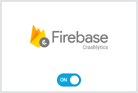

# Amplitude (Android)

## Integration

1. **Switch On the Amplitude in UserExperior Settings**

  Go to UserExperior Dashboard > Go to your app folder > Go to Settings > Select Integrations > Switch On **Amplitude**
  
  

2. **Add UserExperior Listener immediately after startRecording:**

  Add following code in onCreate method of every launcher activity.

  ```
  UserExperior.startRecording(getApplicationContext(), "your-version-key-here");
  
  // UserExperior Listener: Third Party Integration
  UserExperior.setUserExperiorListener(new UserExperiorListener() {
    @Override
    public void onUserExperiorStarted() {
        // Sending UserExperior Session URL to Amplitude
        String ueSessionUrl = UserExperior.getSessionUrl("Amplitude");
        
        JSONObject eventProperties = new JSONObject();
        try{
          eventProperties.put("UE_Session_URL", ueSessionUrl);
        } catch (JSONException exception) {
        }
        Amplitude.getInstance().logEvent("UE_Session_URL", eventProperties);
    }
  });
  ```
  
## Replay of Sessions
 
After completing the integration, every Amplitude session will contain an event called **"UE_Session_URL"**. You can just copy and paste the URL in your browser's window that will open the session in the UserExperior Dashboard. If the session was recorded you will be able to replay it in the UserExperior Dashboard.
