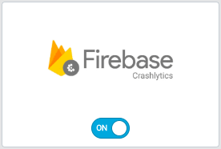

# CleverTap (Android)

CleverTap is the leading customer engagement and retention platform that helps brands maximize user lifetime value. You can extend the functionalities of CleverTap by integrating it with UserExperior. Now you can link CleverTap with UserExperior and understand your users better with UserExperior Session Recording. UserExperior + Crashlytics integration will also help you optimize user experience of your app.

This guide explains how to associate UserExperior Session URL with the CleverTap which enables you to see a step by step session replay with UserExperior Video Recording of the same session in your CleverTap Dashboard.

If you have not integrated UserExperior in your app, go to our SDK Integration Guide and integrate UserExperior first, then follow below steps:

## Integration

1. **Switch On the CleverTap in UserExperior Settings**

  Go to UserExperior Dashboard > Go to your app folder > Go to Settings > Select Integrations > Switch On **CleverTap**
  
  

2. **Add UserExperior Listener immediately after startRecording:**

  Add following code in onCreate method of every launcher activity.

  ```
  UserExperior.startRecording(getApplicationContext(), "your-version-key-here");
  
  // UserExperior Listener: Third Party Integration
  UserExperior.setUserExperiorListener(new UserExperiorListener() {
    @Override
    public void onUserExperiorStarted() {
        // Sending UserExperior Session URL to CleverTap
        String ueSessionUrlCT = UserExperior.getSessionUrl("CleverTap");
        HashMap<String, Object> cleverTapUeMap = new HashMap<String, Object>();
        cleverTapUeMap.put("UE Session URL", ueSessionUrlCT);
        private CleverTapAPI cleverTapDefaultInstance = CleverTapAPI.getDefaultInstance(this);
        if (cleverTapDefaultInstance != null) {
            clevertapDefaultInstance.pushEvent("UE Session URL", cleverTapUeMap);
        }
    }
  });
  ```
  
## Replay of Crashed Sessions
 
After completing the integration, every CleverTap session will contain an event called **"UE Session URL"**. You can just copy and paste the URL in your browser's window that will open the session in the UserExperior Dashboard. If the session was recorded you will be able to replay it in the UserExperior Dashboard.
