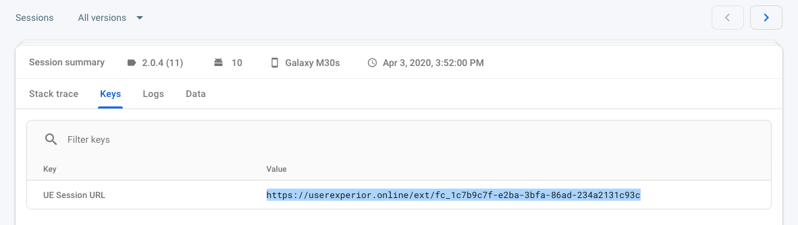

# Firebase Crashlytics + UserExperior

Now you can link Firebase Crashlytics with UserExperior and understand exactly how your app crashed. UserExperior + Crashlytics integration will help you solve the crashes easily, reproduce crashes and reduce crash rates, save your development time with our session recordings.

This guide explains how to associate UserExperior Session URL with the Firebase Crashlytics which enables you to see a step by step session replay of the crashed session in UserExperior.

If you have not integrated UserExperior in your app, go to our SDK Integration Guide and integrate UserExperior first, then follow the below steps:

## Integration

1. **Switch On the Firebase Crashlytics in UserExperior Settings**

  Go to UserExperior Dashboard > Go to your app folder > Go to Settings > Select Integrations > Switch On **Firebase Crashlytics**
  
  

2. **Add UserExperior Listener immediately after startRecording:**

  
  **Android**
  Add the following code in onCreate method of every launcher activity.

  ```
      UserExperior.startRecording(getApplicationContext(), "your-version-key-here");
      
      // UserExperior Listener: Third Party Integration
      UserExperior.setUserExperiorListener(new UserExperiorListener() {
        @Override
        public void onUserExperiorStarted() {
            // Sending UserExperior Session URL to Firebase Crashlytics
            String ueSessionUrlFC = UserExperior.getSessionUrl("FirebaseCrashlytics");
            FirebaseCrashlytics.getInstance().setCustomKey("UE Session URL", ueSessionUrlFC);
        }
      });
  ```
  
  **iOS**
  * **Swift**
   ```
      1. Add/confirm the UserExperiorDelegate protocol
          class AppDelegate: UIResponder, UIApplicationDelegate, UserExperiorDelegate {
          }

      2. Implement UserExperiorDelegate protocol
        func userExperiorSessionStarted() {
            let sessionURL = UserExperior.getSessionUrl("FIREBASE_CRASHLYTICS") // "FIREBASE_CRASHLYTICS" is used for firebase craslytics
            Crashlytics.crashlytics().setCustomValue(sessionURL, forKey: "UE Session URL")
        }
  ```

  * **Objective-C**
   ```
      1. Add/confirm the UserExperiorDelegate protocol
        @interface AppDelegate () <UserExperiorDelegate>
        @end

      2. Implement UserExperiorDelegate protocol
        - (void)userExperiorSessionStarted {
            NSString *sessionURL = [UserExperior getSessionUrl:@"FIREBASE_CRASHLYTICS"]; // "FIREBASE_CRASHLYTICS" is used for firebase craslytics
            [[FIRCrashlytics crashlytics] setCustomValue:sessionURL forKey:@"UE Session URL"];
        }
  ```
  
## Replay of Crashed Sessions
 
After completing the integration, every Crashlytics crash log will contain a key called "UE Session URL". You can just copy and paste the URL in your browser's window that will open the session in the UserExperior Dashboard. If the session was recorded you will be able to replay it in the UserExperior Dashboard.

Go to Firebase Console > Go to your app folder > Crashlytics > Click on the crash you want to debug > Click on the Keys > Copy the highlighted UE Session URL


