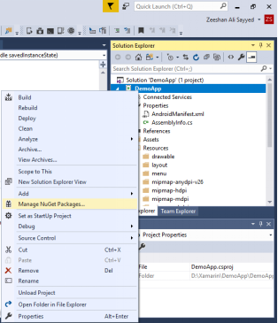
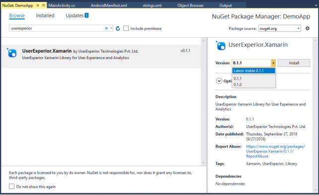

## Integration

**Note**:
-  Perform testing only on Real devices.
-  UserExperior supports os versions from Android JellyBean (4.3) API Level 16 to Android 11 API Level 30!

### 1.  Install UserExperior Library

-   Right Click on your app and select Manage NuGet Packages...

   

-   In NuGet Package Manager, search for the keyword userexperior, you will find UserExperior.Xamarin library, Click on Install, make sure you always select the latest version as shown below:

  

  **Note**: Current latest version is 0.1.8

### 2.  Start UserExperior Library

   ```
    UserExperior.StartRecording(Application.Context, "your-version-key-here");
   ```

   Call the above method in every activity that is an entry point to your app! (Entry activities are usually those which have a custom `<intent-filter>` element in the AndroidManifest.xml file. e.g. MainActivity, Deep Linking Activity, etc.)

-   **Note**

    `Now the integration is completed, build the apk. Install apk in your android device and use the application. After performing activities minimize the app. UserExperior will upload the data, which could be seen within 5-7 minutes on the dashboard.`

-   **Proguard Rules**

    If you are using Proguard in your project, you must add the following lines to your configuration:

    ```
    -dontwarn Com.Userexperior.**
    -keep class Com.Userexperior.** { *; }
    ```

## Customizing UserExperior with Key APIs

### 1. Set User Identifier & additional properties

#### a. Set User Identifier

UserExperior SDK by default takes device id as a user identifier. However, you can specify any unique user identifier of your choice (eg. Email Id, Phone Number, etc.) as a custom user identifier. This identifier will show up in the UserExperior portal.

   Syntax:
   ```
    void setUserIdentifier(String userIdentifier)
   ```

   Eg.
  ```
    UserExperior.setUserIdentifier("abc@xyz.com");
  ```
  Note: Max `userIdentifier` limit is 250 chars only

#### b. Send additional user information

   Syntax:
  ```
    UserExperior.setUserProperties({key1: value1,
                                    key2: value2, ...});
  ```
   Eg.
  ```
    UserExperior.setUserProperties({"start_date": "2020/12/31", // Date-Format: YYYY/MM/DD
                                    "plan_subscribed": "trial"});
  ```
   Note: Please send the `date property` in ``"YYYY/MM/DD"`` format only, if any.

### 2. Log Event

UserExperior SDK lets you log user events based on the scenario. An event is the indication of Progress in the user's session. LogEvent() can be used as follows

#### a. Log event with name

  Syntax:
 ```
   UserExperior.logEvent("YOUR_EVENT");
 ```
  Eg.
 ```
   UserExperior.logEvent("Registration Successful");
 ```
  Note: Max `eventName` limit is 250 chars only

#### b. Log event with name and properties

  Syntax:
 ```
  UserExperior.logEvent("YOUR_EVENT", {"key1:"value1",
                                       "key2:"value2", ...})        
 ```
  Eg.
 ```
  UserExperior.logEvent("Health Profile created", {"age":35,
                                                   "weight":70.5})        
 ```
  Note:
  - Max `eventName` limit is 250 chars only.
  - Please send the `date property` in `"YYYY/MM/DD"` format only, if any.

### 3. Log Message

UserExperior SDK lets you log user message based on the scenario. A message can be any app message shown to the user, any response OR error message OR toast message OR validation messages OR messages shown on dialog boxes, etc. which indicates a response to the user by the app. LogMessage() can be used as follows

#### a. Log message with name

  Syntax:
 ```
   UserExperior.logMessage("YOUR_MESSAGE");
 ```
  Eg.
 ```
   UserExperior.logMessage("User Name or Password is incorrect");
 ```
  Note: Max `messageName` limit is 250 chars only

#### b. Log message with name and properties

  Syntax:
 ```
  UserExperior.logMessage("YOUR_MESSAGE", {"key1:"value1",
                                           "key2:"value2", ...})
 ```
  Eg.
 ```
  UserExperior.logMessage("Login Error", {"status_code:400,
                                          "response_message":"invalid credentials"})
 ```
 Note:
 - Max `messageName` limit is 250 chars only.
 - Please send the `date property` in `"YYYY/MM/DD"` format only, if any.

### 4.  Mask Sensitive Views

   UserExperior SDK by default masks all the Edit Boxes of activities. If you wish to mask any other UI element in your app, you can mask it by:

-   **Using XML Tag**

    ```
    android:tag="com.userexperior.ueSecureView"
    ```

    Code Example: Add above tag in XML of your UI element

    ```
    <WebView
       android:id="@+id/webview2"
       android:layout_width="fill_parent"
       android:layout_height="200dp"
       android:background="@android:color/transparent"
       android:tag="com.userexperior.ueSecureView"/>
    ```

    or you can add Tag Programmatically:

    ```
    anyView = FindViewById<View>(Resource.Id.anyView);
    anyView.SetTag("com.userexperior.ueSecureView");
    ```

-   **Using API**

    ```
    void AddInSecureViewBucket(View view)
    ```

    Code Example:

    ```
    anyView = FindViewById<View>(Resource.Id.anyView);
    SecureViewBucket.AddInSecureViewBucket(anyView);
    ```

### 5.  Identify Screens

   UserExperior SDK automatically detects Activities and defines them as screens. However, If you have used fragments or anything else to represent your screens, then we recommend using the `startScreen` API. This API allows you to manually define screens.

   ```
    void StartScreen(String screenName)
   ```

   Note: Max `screenName` limit is 250 chars only

   Recommendation: Kindly pass hardcoded/fixed values for screen names, do not pass incremental values!

   Code Example:

   ```
    try {
       UserExperior.StartScreen("Notification Tab");
    } catch (Exception e) {
       e.printStackTrace();
    }
   ```

   Note: This method should be usually called from the onResume() method.

### 6.  Track Response Time of Methods/ API Calls

   UserExperior SDK allows you to track the load/response time of the components in your app using APIs called `startTimer` and endTimer. You can call `startTimer` API at any event on the app from which you want to track the load/response time and call an `endTimer` API at the event completion. These APIs will calculate the complete response time.

   ```
    void StartTimer(String timerName)
    void EndTimer(String timerName)
   ```

   Note: Max `timerName` limit is 250 chars only

   Eg: Suppose, you have a ListView on your screen which gets loaded with data you receive from the server. You can call `startTimer` API when the screen resumes to the user and call `endTimer` API when data gets successfully shown in the ListView. Now you can know how much time it takes to load data after the screen is visible to the user. Similarly, you can use `startTimer` at any API call and an `endTimer` on API response.

   Code Example:

   ```
    // Call it at API call
    try {
       UserExperior.StartTimer("Load Money API call");
    } catch (Exception e) {
       e.printStackTrace();
    }

    // call it at API response
    try {
       UserExperior.EndTimer("Load Money API call");
    } catch (Exception e) {
       e.printStackTrace();
    }
   ```

### 7.  Control Recording

   UserExperior SDK has the following APIs which can be used to control the recording. The APIs `stopRecording`, `pauseRecording`, `resumeRecording` are optional and they should be only called when you explicitly want to override the default behavior. Basically, you can use `pauseRecording` and `resumeRecording`  to bypass any user flow which you don't want UserExperior to capture.

   ```
    void StopRecording()
   ```

   By default, recording stops automatically once the app goes to the background. However, you can stop at the desired point by calling this API.

   ```
    void PauseRecording()
   ```

   This API pauses the recording, you can use `resumeRecording` API to resume.

   ```
    void ResumeRecording()
   ```

   This API resumes the recording if it is paused.

### 8.  Get Precise User Location

UserExperior SDK lets you track the location of your user. If your app has location permissions enabled and you wish to know the exact city and country of your users, you can use our API setDeviceLocation. You just have to pass us the location parameters latitude and longitude which you get from the GPS location in your app and through this data, we will only present City and Country on our dashboard which can be used for further analytics.

   ```
    void SetDeviceLocation(double latitude, double longitude)
   ```

   Code Example:

   ```
    try {
       // These are hardcoded lat, long, you can pass actual lat, long if your app uses gps
       UserExperior.SetDeviceLocation(19.154023, 72.945204);
    } catch (Exception e) {
       e.printStackTrace();
    }
   ```

### 9.  Send Handled Exceptions

UserExperior SDK lets you send handled exceptions and their information to UserExperior Dashboard so that you can know where your app caused the handled exceptions. You must send exceptions in the catch block(s) of the handled exception. The exception object's class name (eg. java.lang.NullPointerException) will appear in the storyline of the sessions of your app on the dashboard.

   ```
    void SendException(Throwable exceptionObj, String exceptionTag)
   ```

   Note: Max `exceptionTag` limit is 250 chars only

   Code Example:

   ```
    public void onBack(View view) {
       try{
           // this exception is explicitly thrown just for example
           throw new NullPointerException();
       } catch (NullPointerException e){
           UserExperior.SendException(e, "NullPointerException at MainActivity onBack");
           e.printStackTrace();
       }
       onBackPressed();
    }
   ```


## FAQs

**When can we see the videos of the user's session?**

When the app is minimized to the background then UserExperior SDK processes the session captured and send the information to the UserExperior server.

**How long does it take for the video session to appear on the dashboard?**

From the time the app is minimized to the background the session captured will take 5 to 7 minutes to be reflected on the UserExperior dashboard.

**Will the session upload if I kill the app?**

If the app is killed without minimizing the app to the background, then the session which was killed will not get uploaded. UserExperior will be able to send the data whenever the app is minimized to the background.

**What if the user does not have a network on the mobile device? Will the video get captured?**

If the user does not have an active internet on their device at the time of the start of the session or during the end while uploading, then UserExperior stores the session locally in the apps secure memory. This stored session is sent to the UserExperior server when the users access the app again with an active internet.

**Does UserExperior Track events?**

Yes, By default UserExperior tracks native events. But if you want to track events done on custom controls you can track these events by calling a `Customtag` recognize the event.

**Can I add my own custom event, as we do for other SDK's?**

Yes, you can add custom events using `Customtag` API.

**Can I uniquely identify users session on the dashboard?**

Yes, use SetUserIdentifier API.

**We use fragments in our app, does UserExperior also detect fragments?**

Yes, user `StartScreen` API for fragments. This will allow UserExperior to recognize fragment as a screen.

**Can UserExperior also work on Cordova/Phone gap kind of frameworks?**

Yes

**I am getting a crash which has the following UserExperior entry in the trace `com.userexperior.*.dispatchTouchEvent` ?**

UserExperior intercepts and logs every touch gesture that is occurring within the app, then dispatch it back to the original implementation. The DispatchTouchEvent/ DispatchkeyEvent class is the class that is responsible for this behavior. The reason you see UserExperior in the stack-trace is that the UserExperior SDK was active (had a running thread) during the crash, but it did not cause the app to crash.

You can see the full list of Android methods that could be in the stack-trace here: <https://developer.android.com/reference/android/view/Window.Callback.html>

## Additional Notes

UserExperior SDK also writes some useful logs in the Android Studio IDE during runtime. These logs should be the first point of investigation for any issue you may be facing. Known issues and workarounds:

1.  In case you are getting NoClassDefFoundError, try these steps:

    1.1. Delete the build folder of your project, clean project, Run project.

    1.2. Exit Android Studio and Re-launch it

    1.3. Enable MultiDex in build.gradle for API level >= 21

    1.4. Compile `com.android.support:multidex:1.0.0` in build.gradle dependencies for API level < 21 (check this [link)](https://developer.android.com/studio/build/multidex.html) and add following code in your BaseApplication

    ```
    public void onCreate(Bundle arguments) {
       MultiDex.install(getTargetContext()); super.onCreate(arguments);
       ...
    }
    ```

    1.5. Check if any dependency library is conflicting between UserExperior SDK and your app.

2.  If you are getting 'Access to the dex task is now impossible, starting with 1.4.0', please refer to [this post.](https://stackoverflow.com/questions/34625267/access-to-the-dex-task-is-now-impossible-starting-with-1-4-0)

3.  In case OutOfMemoryError please add the following in `<application>` tag

    ```
    android:[largeHeap]="true"
    ```
